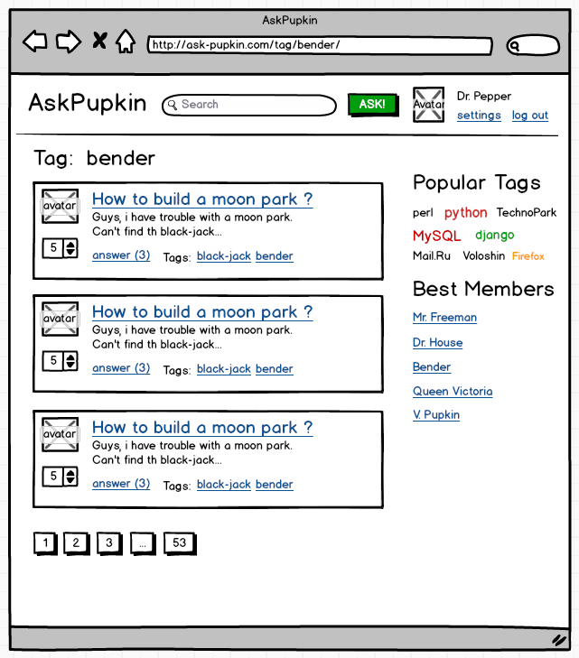

# Техническое задание
В качестве домашнего задания предлагается выполнить проект «Вопросы и Ответы». Этот сервис позволит пользователям Интернета задавать вопросы и получать на них ответы. Возможности комментирования и голосования формируют сообщество и позволяет пользователям активно помогать другим. В качестве образца реализации рекомендуется использовать [Stack Overflow](https://stackoverflow.com).

## Используемые технологии
- Код приложения пишется на **Python + Django**.
- Приложение запускается под управлением сервера **Gunicorn**.
- База данных – **MySQL/PostgreSQL**.
- Для отдачи статики используется **nginx**.
- Для доставки real-time сообщений **Centrifugo**.
- Для кеширования данных – **memcached**.
- Верстка выполняется с использованием **Twitter Bootstrap**.
- Взаимодействие интерфейса с пользователем обеспечивается **JavaScript/jQuery**.
- Для авторизации и хранения пользователей можно использовать приложение **django.contrib.auth**.

## Основные сущности
- Пользователь – электронная почта, никнейм, пароль, аватарка, дата регистрации, рейтинг.
- Вопрос – заголовок, содержание, автор, дата создания, теги, рейтинг.
- Ответ – содержание, автор, дата написания, флаг правильного ответа, рейтинг.
- Тег – слово тега.

## Основные страницы и формы
1. **Листинг вопросов** с пагинацией по 20 вопросов на странице. Необходимо реализовать сортировку по дате добавления и рейтингу (2 вида сортировки). В шапке сайта находятся: логотип, поисковая строка (для быстрого поиска по заголовку и содержимому вопроса), кнопка задать вопрос (доступна только авторизованным). В правой части шапки - юзерблок. Для авторизованного пользователя юзерблок содержит его ник, аватарку, ссылки на “выход” и на страницу с его профилем. Для неавторизованных - ссылки “войти” и “регистрация”. В правой колонке - информационные блоки “Популярные тэги” и “Лучшие пользователи” (описание ниже). Во всех листингах присутствуют кнопки “лайк/дизлайк”, позволяющие менять рейтинг вопроса.

  

2. **Страница добавления вопроса** (можно сделать оверлеем). Доступна только для авторизованных пользователей. В форма вводится заголовок, текст вопроса и теги, через запятую. С вопросом может быть связано не более 3 тегов. Для подсказки при выборе тега можно использовать готовый jquery плагин. Готовые django приложения для тегов использовать запрещается. При обработке формы обязательно проверка валидности данных. Если вопрос успешно добавлен - пользователя перебрасывает на страницу вопроса, если возникли ошибки - их нужно отобразить в форме.

  

3. **Страница вопроса со списком ответов**. На странице вопроса можно добавить ответ. Ответы сортируются по рейтингу и дате добавления при равном рейтинге. Ответы разбиваются по 30 штук на странице. Форма добавления ответа находится на странице вопроса. Отображается только для авторизованных пользователей. После добавления ответа, автор вопроса должен получить email с уведомление от новом ответе. В этом письме должна быть ссылка для перехода на страницу вопроса. Автор вопроса может пометить один из ответов как правильный. Пользователи могут голосовать за вопросы и ответы с помощью лайков «+» или «–». Один пользователь может голосовать за 1 вопрос и ответ только 1 раз, однако может отменить свой выбор или переголосовать неограниченное число раз.

  

4. **Листинг вопросов по тегу**. На этой странице выводятся все вопросы содержащие некоторый тег. Сортировка по рейтингу вопроса. Пагинация по 20 вопросов. Пользователи попадают на эту страницу кликая по одному из тегов в описании вопроса.

  

5. **Страница пользователя** содержит его настройки - email, nick и аватарку. Каждый пользователь может смотреть только свою страницу. У пользователя должна быть возможность изменить email, nick и аватарку.

  

6. **Форма авторизации**. Состоит из поля логин и пароль. Дополнительно есть ссылка на форму регистрации. При успешной авторизации пользователь перебрасывается на исходную страницу, при неуспешной авторизации в форме выводятся сообщения об ошибках формы. Для авторизованных пользователей вместо этой формы должна показываться кнопка “Выйти”.

  

7. **Страница регистрации**. Любой пользователь может зарегистрироваться на сайте, заполнив форму с электронной почтой, никнеймом, аватаркой и паролем. Аватарка загружается на сервер и отображается рядом с вопросами и ответами пользователя. При неудачной регистрации в форме необходимо выводить сообщения об ошибках.

  

8. **Блок популярных тегов**. В правой колонке сайте находится облако из 20 наиболее популярных тегов. Популярными считаются те теги, которые были использованы в наибольшем количестве вопросов. Генерация этого блока занимает много времени, поэтому этот блок необходимо генерировать в фоне, с помощью cron скрипта.

9. **Блок лучших пользователи** (недели). В блок лучшие пользователи попадают 10 авторов задавших самые популярные вопросы или ответы за последнюю неделю. Т.е. вопросы и ответы, созданные за последнюю неделю сортируем по рейтингу. Выбираем топ N, их авторы и будут “лучшими”. Генерация этого блока занимает много времени, поэтому блок нужно подготавливать в фоне, с помощью cron скрипта.

## Требования к проекту
1. Структура проекта должна быть понятна пользователям. Переходы по страницам осуществляются по ссылкам. Обработка форм должна осуществляться с редиректом.
2. Код проекта должен быть аккуратным и без дублирования. Наличие больших повторяющихся фрагментов кода или шаблонов могут быть причиной снижения баллов.
3. Верстка проекта должна быть выполнена с помощью css фреймворка Twitter Bootstrap.
4. Код приложения должен быть чувствителен к входным данным и выдавать соответствующие коды и тексты ошибок. Сообщение пользователям «Вопрос добавлен», «Вопрос не был добавлен, потому что» выводятся в оверлее. Ответ сервера с кодом 500 может быть причиной снижения баллов.
5. Время генерации страницы не должно зависеть от объема данных в базе.
6. Страницы проекты не должны отдаваться более 1 секунды.

## Требования к объему данных
- Пользователи > 10 000.
- Вопросы > 100 000.
- Ответы > 1 000 000.
- Тэги > 10 000.
- Оценки пользователей > 2 000 000.

# Оценка и баллы
## Оценка за курс
- **0 - 39** — неудовлетворительно.
- **40 - 59** — удовлетворительно.
- **60 - 79** — хорошо.
- **80 - 100+** — отлично.

## Баллы
- ДЗ 1 “Статическая верстка” - **16 баллов** [(подробнее)](task-1.md)
- ДЗ 2 “Обработка HTTP запросов” - **14 баллов** [(подробнее)](task-2.md)
- ДЗ 3 “Работа с базой данных” - **16 баллов** [(подробнее)](task-3.md)
- ДЗ 4 “Авторизация и обработка форм” - **15 баллов** [(подробнее)](task-4.md)
- ДЗ 5 “Изображения и обработка AJAX запросов” - **11 баллов** [(подробнее)](task-5.md)
- ДЗ 6 “Настройка серверов” - **14 баллов** [(подробнее)](task-6.md)
- ДЗ 7 “Дополнительные функции” - **20 баллов** [(подробнее)](task-7.md)